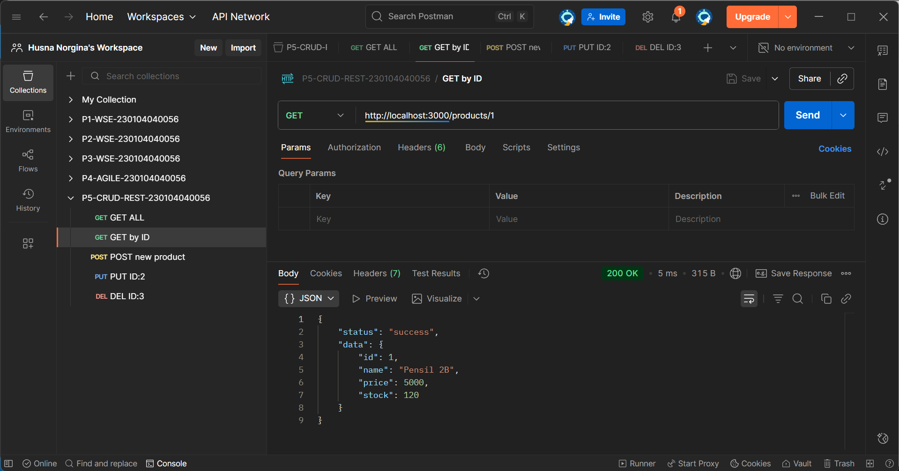
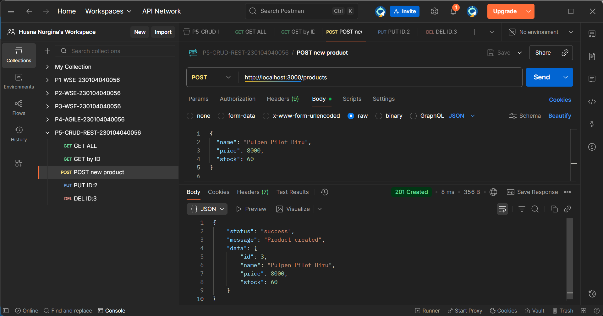
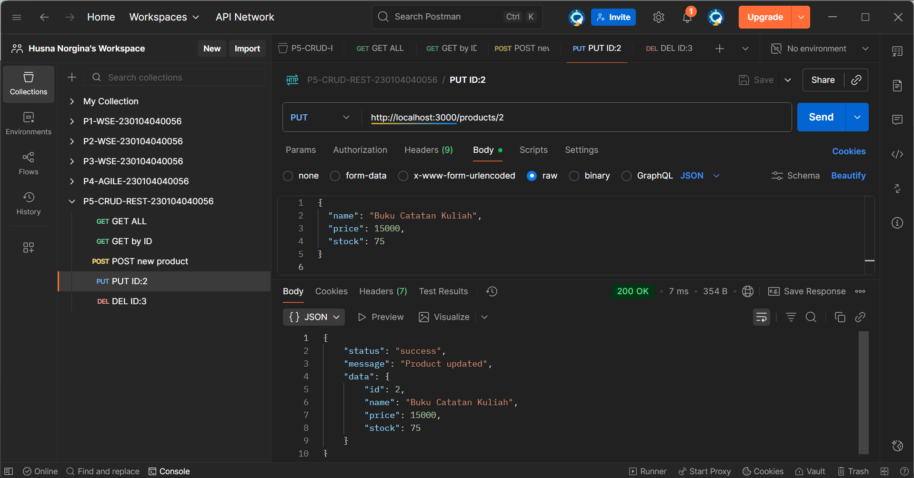

# 🌐 Praktikum — RESTful CRUD API dengan Express

Praktikum ini membahas **pembangunan RESTful API sederhana** menggunakan **Node.js dan Express.js** dengan menerapkan operasi dasar **CRUD (Create, Read, Update, Delete)**. Pengujian endpoint dilakukan menggunakan **Postman / Thunder Client** untuk memastikan setiap request–response berjalan sesuai standar HTTP.

**Topik:** RESTful CRUD API (Express.js)

---

## 🧑‍🎓 Informasi Mahasiswa

| Informasi          | Data                                                       |
|--------------------|------------------------------------------------------------|
| Mata Kuliah        | Web Service Engineering                                    |
| Dosen Pengampu     | Muhayat, M.IT                                              |
| Praktikum / Proyek | P5 – RESTful CRUD API                                      |
| Nama Mahasiswa     | Husna Norgina                                              |
| NIM                | 230104040056                                               |
| Kelas              | TI23B                                                      |
| Repo GitHub        | https://github.com/husna-norgina/P5-CRUD-REST-230104040056 |
| Tanggal Praktikum  | 03-11-2025                                                 |

---

## 🎯 Tujuan Praktikum

1. Membangun RESTful API sederhana menggunakan Express.js.
2. Mengimplementasikan operasi CRUD (Create, Read, Update, Delete).
3. Menggunakan HTTP Method dan Status Code secara tepat.
4. Memahami struktur dasar API server berbasis Node.js yang modular.

---

## 🛠 Tools & Environment

### **Tools yang Digunakan**
- Node.js 18+
- Express.js
- Visual Studio Code
- Nodemon
- Postman / Thunder Client
- Git & GitHub

---

## 🧱 Arsitektur Sistem

**Alur Sistem:**
- Client (Postman / Thunder Client)
- API Server (Express.js)
- Router (`products.routes.js`)
- Data sementara (`products.data.js`)
- Response JSON ke client

Arsitektur ini menggunakan pola **Client–Server** dengan pemisahan logika routing dan data.

---

## 🔁 Pengujian & Implementasi API

---

### 🔵 1. GET — Ambil Semua Produk

| Method | Endpoint         | Keterangan                    |
|--------|------------------|-------------------------------|
| GET    | `/api/products`  | Menampilkan seluruh produk    |

**Hasil:**

Menampilkan seluruh data produk dalam format JSON.
Server merespons status `200 OK`.

---

### 🔵 2. GET — Ambil Produk Berdasarkan ID

| Method | Endpoint               | Keterangan                       |
|--------|------------------------|----------------------------------|
| GET    | `/api/products/{id}`   | Menampilkan produk tertentu      |

**Hasil:**

Menampilkan satu data produk berdasarkan ID tertentu.
Server merespons status `200 OK` atau `404 Not Found`.

---

### 🔵 3. POST — Tambah Produk Baru

| Method | Endpoint         | Keterangan            |
|--------|------------------|-----------------------|
| POST   | `/api/products`  | Menambahkan produk    |

**Hasil:**

Menambahkan data produk baru ke dalam sistem.
Server merespons status `201 Created`.

---

### 🔵 4. PUT — Update Data Produk

| Method | Endpoint               | Keterangan              |
|--------|------------------------|-------------------------|
| PUT    | `/api/products/{id}`   | Mengubah data produk    |

**Hasil:**

Memperbarui data produk yang sudah tersimpan berdasarkan ID.
Server merespons status `200 OK` atau `404 Not Found`.

---

### 🔵 5. DELETE — Hapus Produk

| Method | Endpoint               | Keterangan          |
|--------|------------------------|---------------------|
| DELETE | `/api/products/{id}`   | Menghapus produk    |

**Hasil:**

Menghapus data produk berdasarkan ID tertentu.
Server merespons status `200 OK` atau `404 Not Found`.

---

## 📄 Laporan Praktikum 5

[230104040056_Husna Norgina_P5.pdf](<evidence/230104040056_Husna Norgina_P5.pdf>)

---

> Semua screenshot hasil uji endpoint dan laporan praktikum disimpan pada folder:  
> 📂 `./evidence/`

---

## 📊 Analisis Praktikum

- Seluruh endpoint CRUD berjalan sesuai prinsip REST.
- Status code HTTP digunakan dengan tepat.
- Response API dikembalikan dalam format JSON terstruktur.
- Validasi input dan error handling masih sederhana dan dapat dikembangkan lebih lanjut.

---

## ✅ Kesimpulan

Berdasarkan praktikum yang telah dilakukan, RESTful CRUD API berhasil dibangun menggunakan Express.js. Hasil pengujian menunjukkan bahwa seluruh endpoint berfungsi dengan baik untuk operasi Create, Read, Update, dan Delete. Setiap request menghasilkan response JSON yang terstruktur serta status code HTTP yang sesuai dengan standar REST.

---

## 📌 Catatan

- Data disimpan sementara (in-memory).
- Pengujian dilakukan menggunakan Postman.
- API dikembangkan untuk keperluan pembelajaran.

---

📝 *Disusun oleh Husna Norgina (230104040056) — Praktikum 5 Web Service Engineering*
